<h2>

Active Directory Lab – Installing Active Directory Domain Services (AD DS)
</h2>

With the lab environment fully configured and connectivity verified, the next step is installing 
<strong>Active Directory Domain Services (AD DS)</strong> on the Domain Controller. 
Active Directory provides centralized authentication, authorization, and directory management for users, computers, and other resources within a Windows network.

In this section, the Domain Controller virtual machine (<strong>DC-01</strong>) will be prepared for Active Directory installation using the Server Manager role installation wizard.

 

<h3>Opening Server Manager</h3>

Begin by opening the Start menu on the Domain Controller and launching <strong>Server Manager</strong>.
Server Manager is the primary administrative console used to manage roles, features, and server configurations within Windows Server environments.

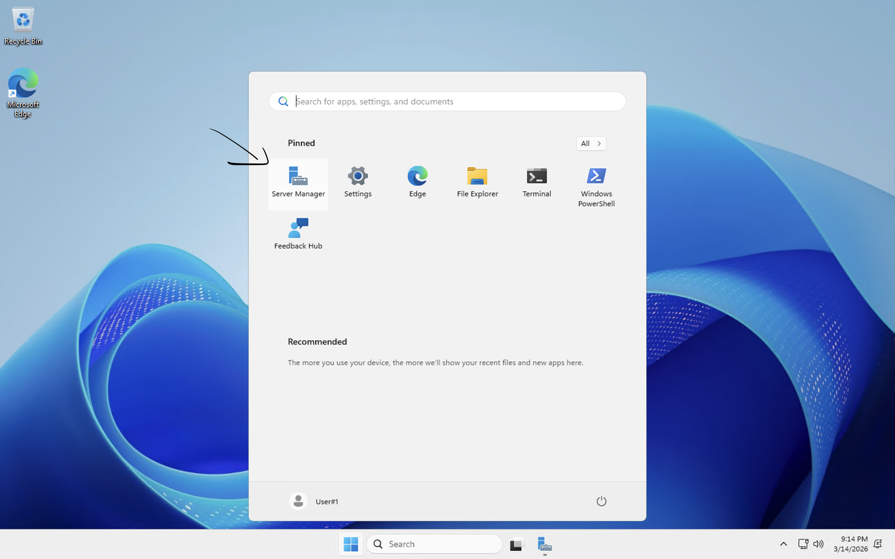

 

<h3>Adding Roles and Features</h3>

Within the Server Manager dashboard, select <strong>Add roles and features</strong>.
This option launches the Add Roles and Features Wizard, which allows administrators to install services such as Active Directory, DNS, DHCP, and other server roles.

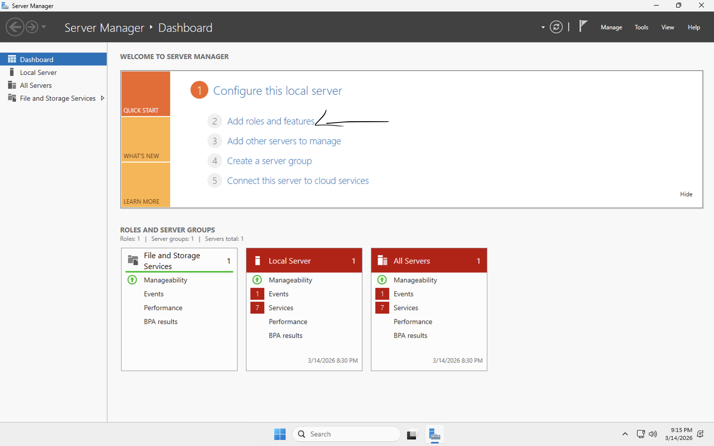

 

<h3>Selecting the Destination Server</h3>

When the Add Roles and Features Wizard opens, navigate to the <strong>Server Selection</strong> step.
Ensure that the Domain Controller virtual machine (<strong>DC-01</strong>) is selected as the destination server for the installation.

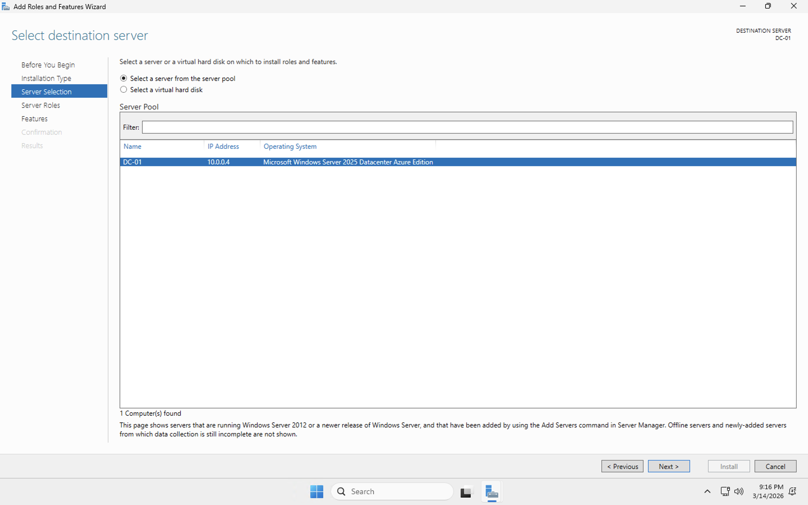

 

<h3>Selecting the Active Directory Domain Services Role</h3>

In the <strong>Server Roles</strong> section, locate and select <strong>Active Directory Domain Services</strong>.
This role installs the core services required to create and manage an Active Directory domain.

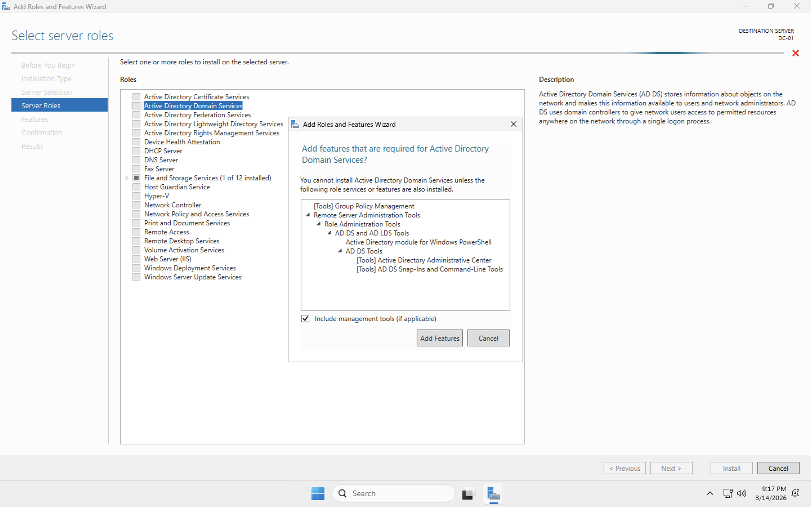

When prompted, choose <strong>Add Features</strong> to install the additional management tools required for Active Directory administration.
These tools include utilities such as the Active Directory Administrative Center, PowerShell modules, and management consoles used to administer domain objects.

 

<h3>Confirming Required Features</h3>

The wizard will display the features that will be installed alongside Active Directory Domain Services.
These supporting tools are necessary for managing domain controllers, users, organizational units, and group policies.

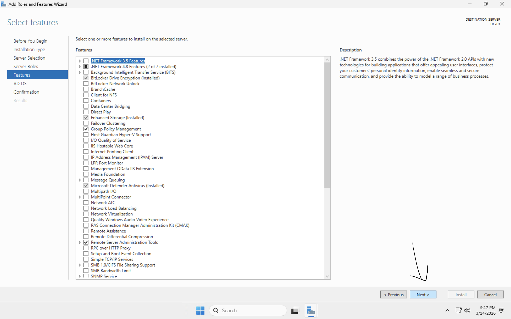

After reviewing the required features, select <strong>Next</strong> to proceed through the remaining configuration steps.

The installation wizard will continue with additional configuration screens before the Active Directory Domain Services role is installed on the server.

 

<h3>Confirming Installation of Active Directory Domain Services</h3>

Before the role installation begins, the Add Roles and Features Wizard displays a summary of the selected components that will be installed on the server.

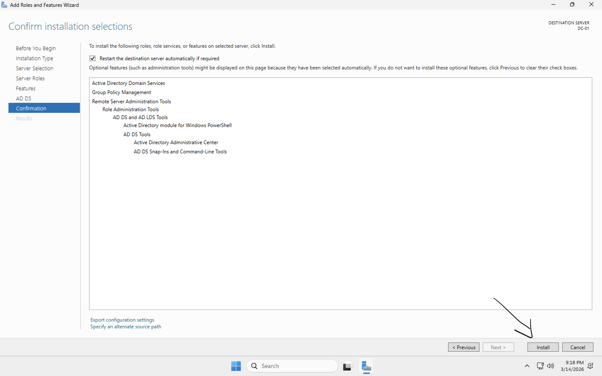

Review the listed components, which include Active Directory Domain Services along with the required administrative tools. 
Once the configuration is confirmed, select <strong>Install</strong> to begin installing the role on the Domain Controller.

 

<h3>Active Directory Domain Services Installation Progress</h3>

The wizard will begin installing the selected role and required features on the server.

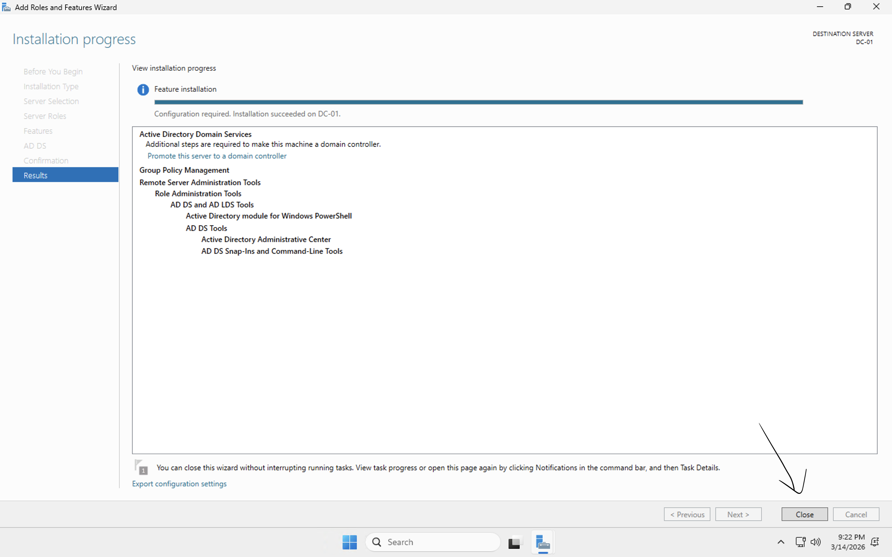

Once the installation finishes successfully, the wizard indicates that additional configuration is required before the server can function as a Domain Controller.
At this point, the server must be promoted to a domain controller.

 

<h3>Promoting the Server to a Domain Controller</h3>

After installation completes, Server Manager displays a notification indicating that post-deployment configuration is required.
Select <strong>Promote this server to a domain controller</strong> to launch the Active Directory Domain Services Configuration Wizard.

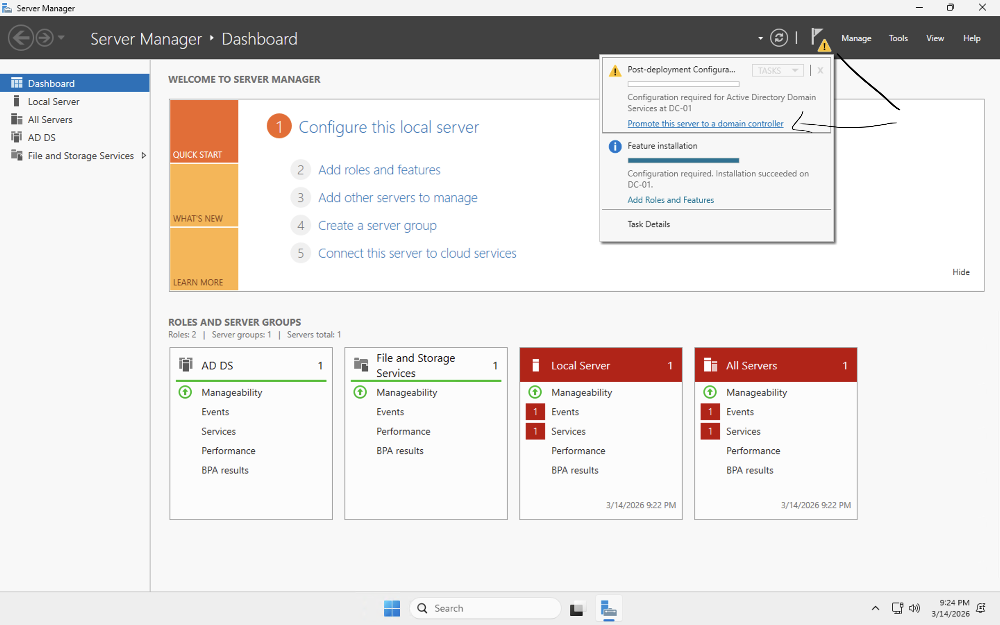

 

<h3>Creating a New Active Directory Forest</h3>

Within the Deployment Configuration step, choose <strong>Add a new forest</strong>.
This option creates a completely new Active Directory environment.

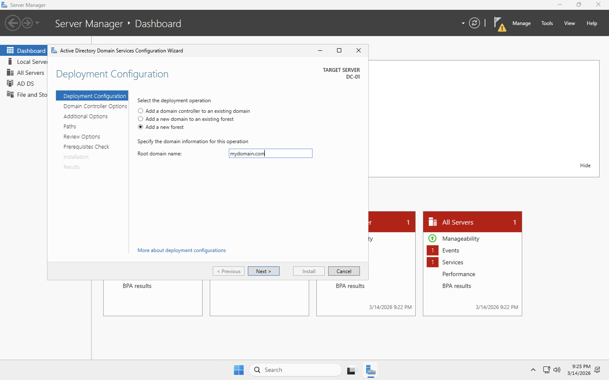

Enter a root domain name for the environment. In this lab, the domain name <strong>mydomain.com</strong> is used to represent the internal Active Directory domain.

 

<h3>Configuring Domain Controller Options</h3>

Next, configure the domain controller settings for the new forest.

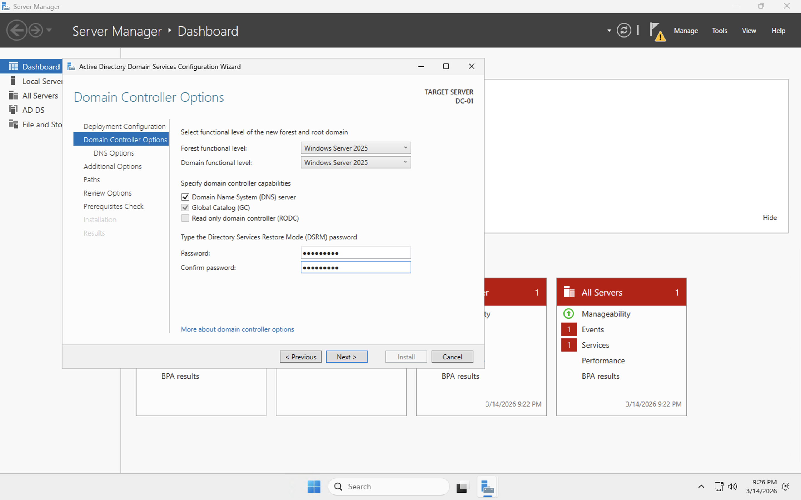

The forest and domain functional levels are set to <strong>Windows Server 2025</strong>, allowing the environment to use the latest Active Directory features available for this server version.

A <strong>Directory Services Restore Mode (DSRM) password</strong> must also be configured. 
This password is used for recovery and maintenance tasks if the Active Directory database ever needs to be restored.

 

<h3>DNS Configuration Warning</h3>

During the DNS Options step, a warning may appear indicating that a delegation for the DNS server cannot be created.

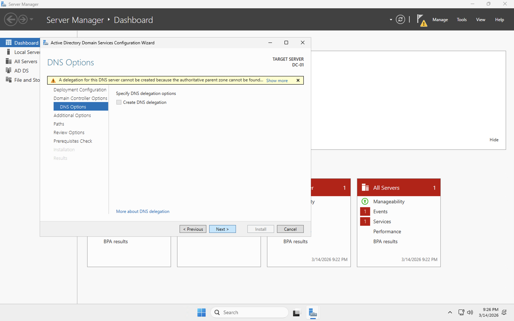

This warning is expected in a new lab environment because there is no existing parent DNS infrastructure.
Since this is the first domain controller in a new forest, the system will automatically install and configure the DNS service for the new domain.

Select <strong>Next</strong> to continue with the remaining configuration steps.

 

<h3>Configuring the NetBIOS Domain Name</h3>

During the Additional Options step, the wizard automatically assigns a NetBIOS name to the domain based on the root domain name that was previously configured.

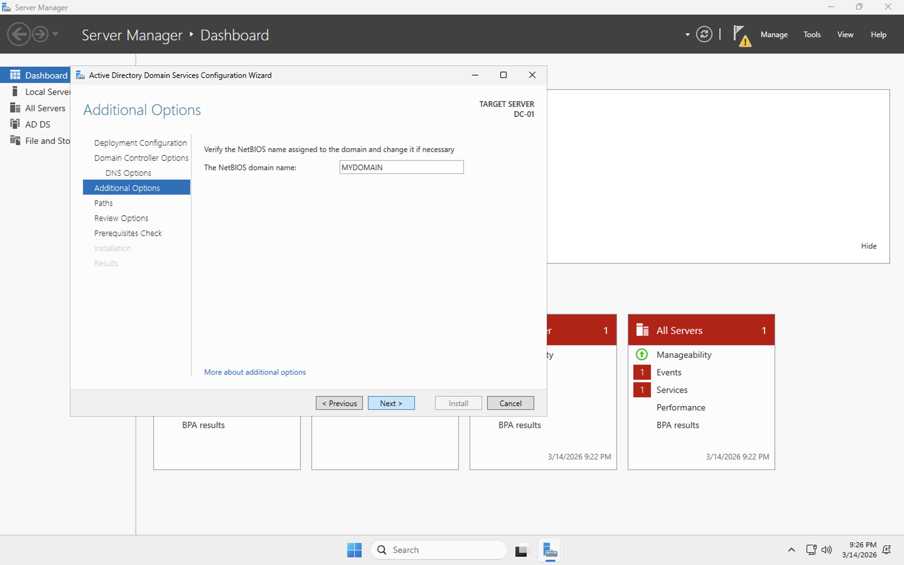

The NetBIOS domain name is used for compatibility with legacy systems and older authentication methods. In this lab, the NetBIOS name <strong>MYDOMAIN</strong> is automatically generated from the root domain <strong>mydomain.com</strong>. The default value is accepted and the configuration proceeds by selecting <strong>Next</strong>.

 

<h3>Running Active Directory Prerequisite Checks</h3>

Before the domain controller promotion begins, the system performs a set of prerequisite checks to validate the configuration.

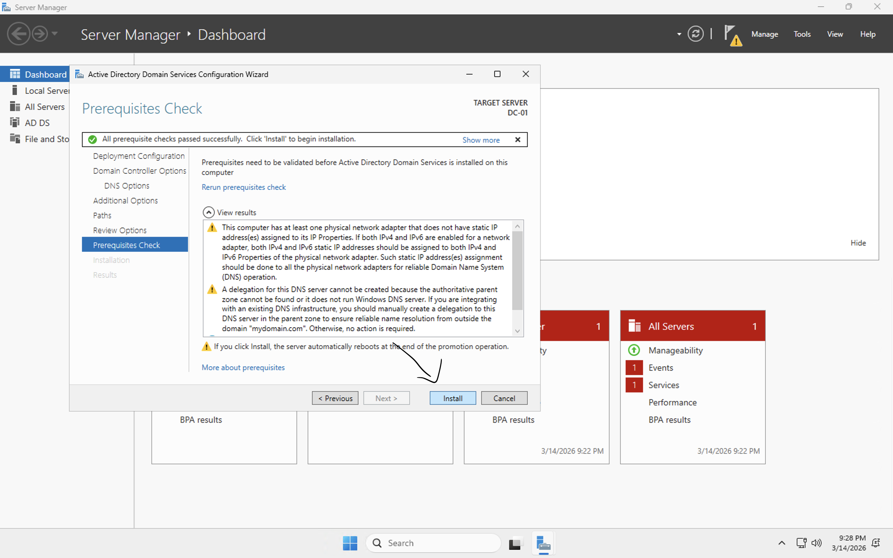

These checks verify that the server environment is prepared for Active Directory Domain Services installation. Warnings may appear regarding DNS delegation or static IP configuration. In a new lab environment, these warnings are expected and do not prevent installation.

After confirming that all required checks have passed, select <strong>Install</strong> to begin the domain controller promotion process.

 

<h3>Domain Controller Installation and Automatic Restart</h3>

Once installation begins, the server configures the Active Directory database, DNS services, and domain controller functionality.

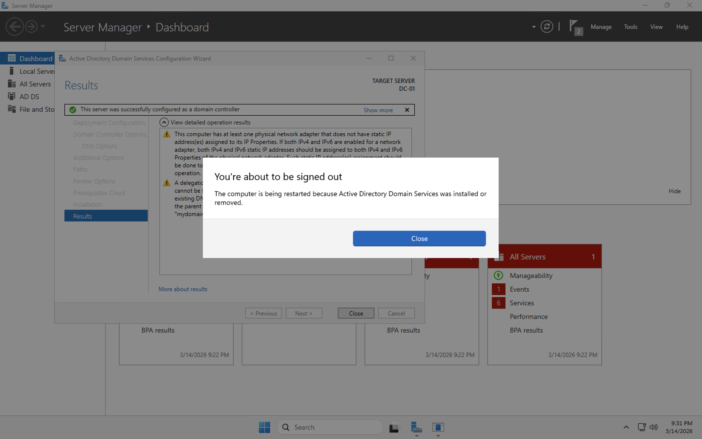

After the installation completes, the system automatically restarts the server to finalize the configuration of Active Directory Domain Services.

 

<h3>Logging Back Into the Domain Controller</h3>

After the reboot, the administrator reconnects to the server using domain credentials.

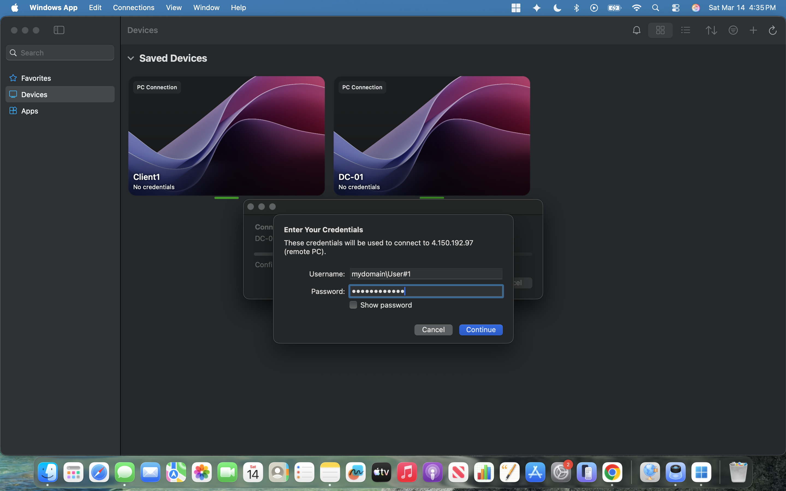

Instead of using the local administrator account, the login now uses the newly created domain account format:
<strong>mydomain\user#1</strong>. This confirms that the server is now operating as a domain controller within the Active Directory environment.

 

<h3>Opening Active Directory Users and Computers</h3>

With Active Directory successfully installed, administrative tools become available on the server. The Active Directory Users and Computers console can be opened through the Windows search menu.

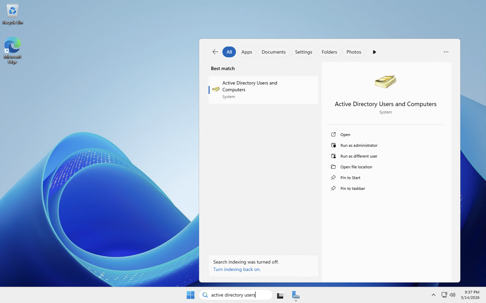

This management console is used to create and manage users, groups, computers, and organizational units within the Active Directory domain.

 

<h3>Verifying the Active Directory Domain</h3>

Opening the Active Directory Users and Computers console confirms that the domain environment has been successfully created.

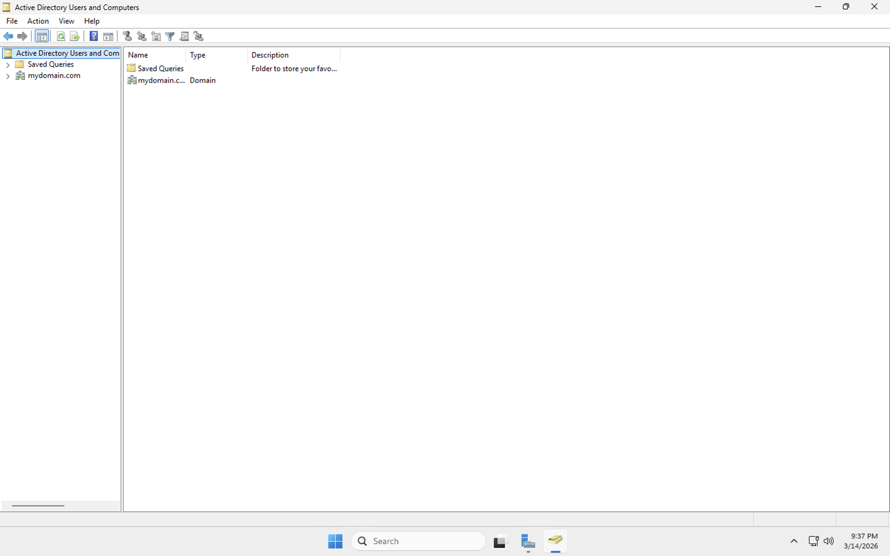

The domain <strong>mydomain.com</strong> now appears within the directory structure. From this interface, administrators can begin managing domain resources, creating user accounts, and organizing directory objects for the enterprise environment.

 

<h3>Active Directory Deployment Complete</h3>

At this stage, the domain controller is fully configured and the Active Directory environment is operational. The server now provides centralized authentication, directory services, and policy management for systems that join the domain.

